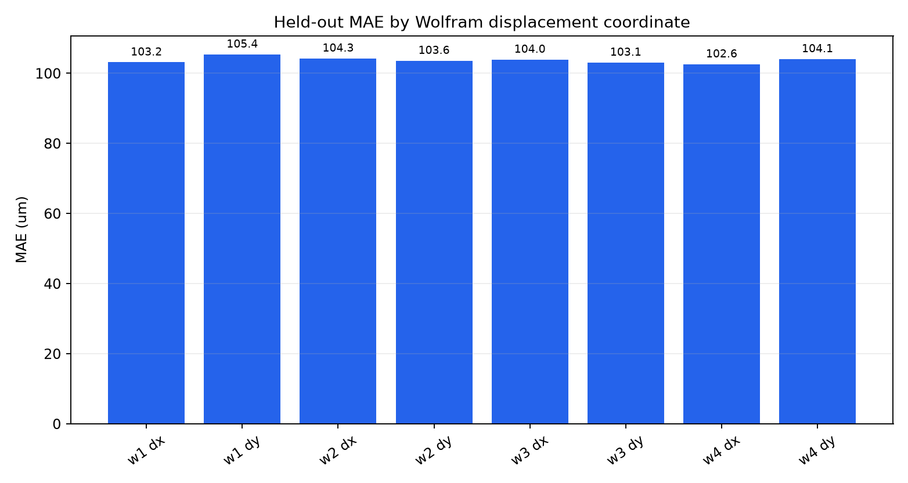
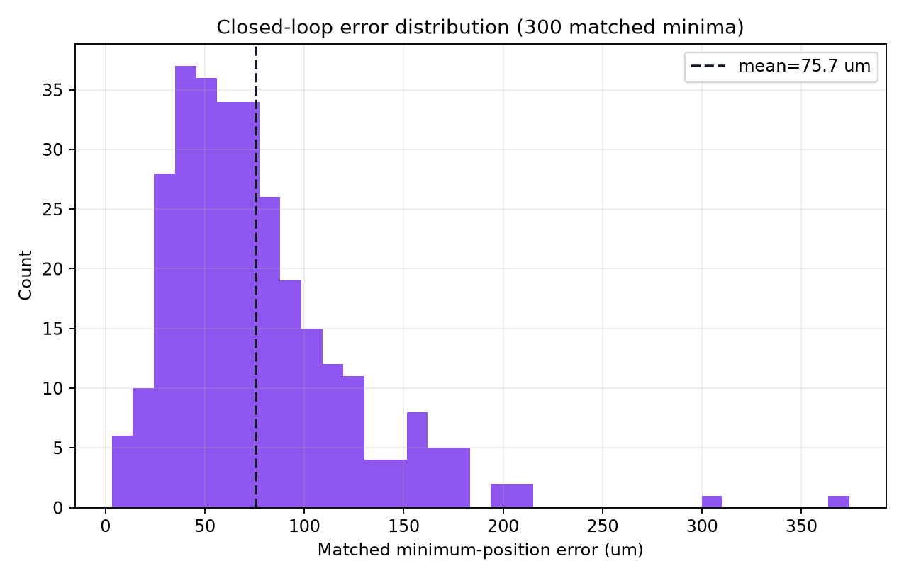
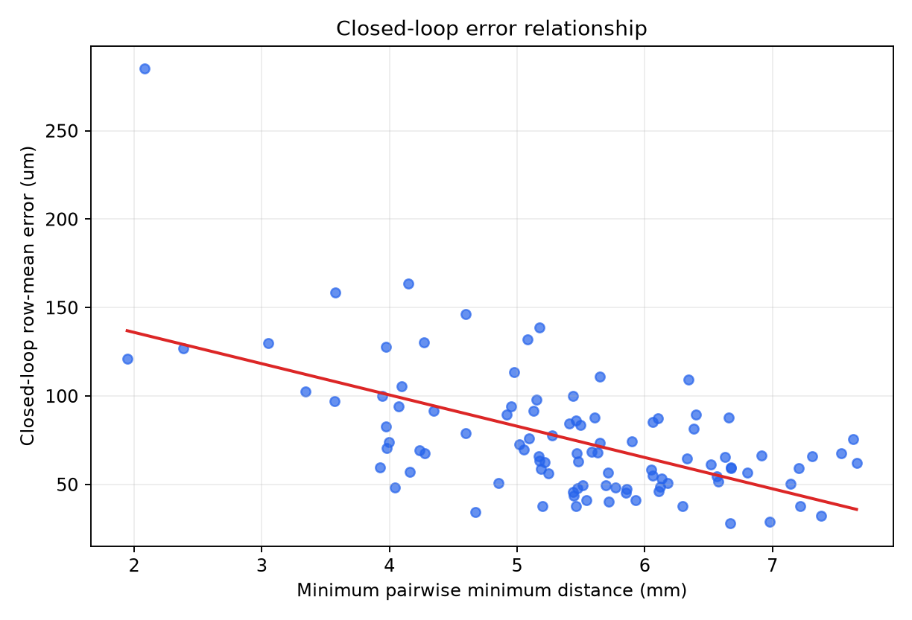

# Merged N=29995 inverse error analysis

This report analyzes only the saved MLP held-out predictions, the saved N=100
closed-loop results, and the existing merged dataset. It runs no FEM solve,
generates no samples, retrains no saved production model, and changes no
numerical result.

## Inputs and reproducibility

- `validation_results/inverse_model_merged_29995/test_predictions.csv`
- `validation_results/closed_loop_inverse_merged_29995_n100/closed_loop_results.csv`
- `validation_results/generated_dataset_merged_29995/synthetic_clean_ml.csv`

The analysis recomputes coordinate errors from true and predicted metre-valued
Wolfram-order displacements rather than trusting stored error columns. The
closed-loop row mean, median, and maximum values reproduce the three stored
matched-minimum errors with zero discrepancy.

## Held-out inverse errors

The merged MLP has 5999 held-out rows and 47992 individual displacement-coordinate
errors. Its aggregate MAE is 103.792467 um, RMSE is 132.485981 um, p95 absolute
coordinate error is 267.277336 um, and maximum absolute error is 542.911477 um.

| Coordinate | Signed bias (um) | MAE (um) | Median abs. (um) | p95 abs. (um) | Max abs. (um) |
|---|---:|---:|---:|---:|---:|
| W1 dx | -4.078 | 103.176 | 83.904 | 260.559 | 509.658 |
| W1 dy | -3.163 | **105.433** | 85.940 | 273.540 | 488.902 |
| W2 dx | -0.970 | 104.293 | 83.447 | 269.961 | 507.918 |
| W2 dy | -0.176 | 103.633 | 84.444 | 265.377 | 486.616 |
| W3 dx | 0.854 | 103.966 | 83.407 | 271.534 | 485.228 |
| W3 dy | 4.075 | 103.113 | 83.982 | 259.197 | 503.668 |
| W4 dx | 5.470 | **102.620** | 84.119 | 260.199 | 542.911 |
| W4 dy | -0.361 | 104.105 | 83.146 | 272.798 | 483.989 |

W1-dy is numerically the hardest coordinate by MAE, but the entire coordinate
range is only 102.62--105.43 um. The signed biases are also small compared with
the absolute errors. The evidence therefore does not identify one electrode or
axis as a distinct systematic reconstruction failure.

| Electrode | Mean vector error (um) | Median (um) | p95 (um) | Maximum (um) |
|---|---:|---:|---:|---:|
| W1 | **165.090** | 153.877 | 331.856 | 537.260 |
| W2 | 164.423 | 151.816 | 332.600 | 523.690 |
| W3 | 163.862 | 151.942 | 329.048 | 515.150 |
| W4 | **163.623** | 151.198 | 329.265 | 549.760 |

Again, the per-electrode means differ by less than 1%. W1 is only marginally
hardest on the mean-vector metric, while W4 contains the single largest vector
error. This is a broadly distributed regression error rather than an isolated
electrode-specific weakness.

Of all coordinate errors, 6491/47992 (13.5%) exceed 200 um and 1331/47992
(2.77%) exceed 300 um. The tail is real, but it is not the dominant mass of the
held-out distribution.

## Closed-loop error distribution and worst cases

The saved N=100 loop contains 300 matched minimum errors. The recomputed mean,
median, p95, and maximum remain 75.731039, 66.530430, 163.043850, and
373.952285 um. All 100 rows have valid three-minimum topology and status `ok`.

Only 4/300 matched errors exceed 200 um and 2/300 exceed 300 um. Three rows have
row-mean error above 150 um, and only one row exceeds 200 um. The largest errors
are therefore rare tail cases rather than a uniform shift of the full
closed-loop distribution.

The worst row is sample 5202: its three matched errors are 373.952, 307.275,
and 174.045 um, giving a 285.091 um row mean. Its true 8D displacement norm is
911.690 um and its minimum pairwise separation is 2.083 mm. The complete top-10
table is `worst_10_closed_loop_cases.csv`; ranking uses row maximum error and
then row mean error.

## Error relationships

Relationships use row-mean closed-loop error for the fixed 100-case subset.

| Predictor | Pearson r | Pearson p | Spearman rho | Spearman p | Interpretation |
|---|---:|---:|---:|---:|---|
| True 8D displacement norm | 0.194 | 0.0536 | 0.140 | 0.1646 | Weak evidence only |
| Minimum pairwise distance | -0.580 | 2.63e-10 | -0.509 | 6.41e-8 | Smaller separation is associated with larger error in this subset |
| Maximum absolute minimum coordinate | -0.291 | 0.00326 | -0.159 | 0.1130 | Weak/non-monotonic association |

The minimum-separation relationship is the clearest descriptive signal in this
sample. It supports stratifying future ML validation by minimum separation, but
it does not prove a physical cause or justify changing the forward model.

## What this analysis can and cannot prove

This analysis can locate difficult output coordinates, quantify error tails,
identify the existing worst closed-loop rows, and test descriptive associations
inside the saved synthetic validation samples. It cannot establish inverse
uniqueness, experimental accuracy, causal physics, harmonic suppression, or
electrode-alignment efficiency. The 6-coordinate input and 8-coordinate target
also remain underdetermined at the coordinate level.

Based on ML metrics alone, adding Semen's future 20k dataset is likely to reduce
average regression error modestly if it is compatible and adds non-duplicate
coverage. The accompanying learning curve is still decreasing, but its slope is
flattening. The current evidence does not support expecting a comparable
improvement in maximum error or closed-loop error without actually evaluating
those outputs.

The next ML step should be repeated-seed or cross-validated model comparison on
one fixed test protocol, with metrics stratified by minimum separation and with
explicit tail/uncertainty reporting. That will determine whether sub-micrometre
learning-curve differences are reproducible before introducing more complex
representations or objectives.

All machine-readable tables and plots are under
`validation_results/error_analysis_merged_29995`.
