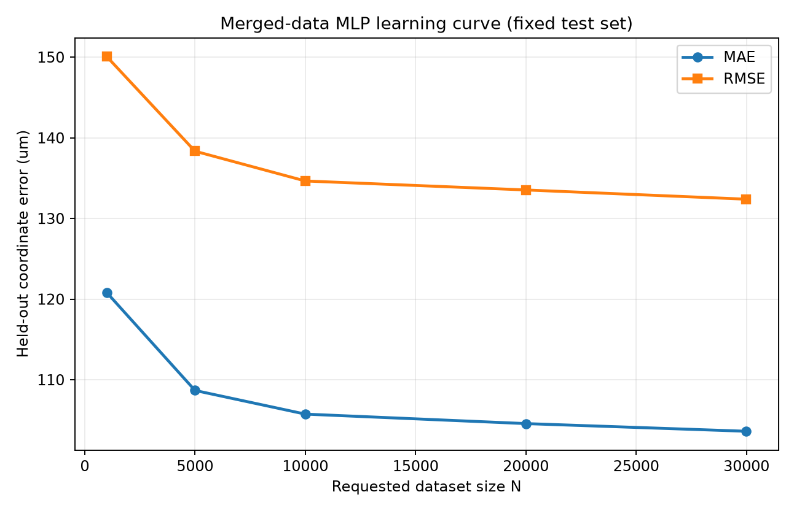

# Merged N=29995 MLP learning curve

This experiment measures only synthetic held-out inverse-regression error. It
does not run FEM, generate new samples, save replacement models, or change the
current production result.

## Method

The merged dataset is split once with `test_size=0.2` and `random_state=42`,
producing a 23996-row training pool and one fixed 5999-row test set. Nested,
deterministically shuffled subsets of the training pool are used for every
point. Requested N therefore corresponds to the usual 80% training share:
800, 4000, 8000, 16000, and 23996 training rows.

Every point uses the existing standardized MLP configuration from the baseline
pipeline. All points are evaluated on the same test rows, so changes primarily
measure training-set size rather than test-sample variation. No fitted model is
saved by this experiment.

## Results

| Requested N | Training rows | Fixed test rows | MAE (um) | RMSE (um) | Max abs. (um) | Incremental MAE gain (um) |
|---:|---:|---:|---:|---:|---:|---:|
| 1000 | 800 | 5999 | 120.805389 | 150.065385 | 580.788191 | -- |
| 5000 | 4000 | 5999 | 108.673243 | 138.338341 | 690.648183 | 12.132145 |
| 10000 | 8000 | 5999 | 105.740198 | 134.646840 | 538.559993 | 2.933045 |
| 20000 | 16000 | 5999 | 104.563974 | 133.533373 | 535.056322 | 1.176225 |
| 29995 | 23996 | 5999 | **103.613591** | **132.388747** | 549.919969 | 0.950382 |

From N=1000 to N=29995, MAE falls by 17.191797 um, or 14.23%. The curve is
monotonically improving in MAE and RMSE, but the gain per added row is shrinking
substantially. Maximum error is not monotonic: it rises at N=5000 and again from
N=20000 to N=29995.

## Interpretation

The MLP is still mildly data-limited because average error continues to improve
through the largest point. It is also clearly in a diminishing-returns regime:
adding roughly 10k rows from N=20000 to N=29995 improves MAE by only 0.95 um.

On the same-distribution ML evidence, another 20k compatible, non-duplicate
samples are likely to improve MAE, but probably by only a small number of
micrometres unless they materially improve coverage of difficult regions. This
is a directional conclusion, not a reliable numeric extrapolation. The current
curve does not show that more data alone will improve the maximum-error tail.

The full-point MAE of 103.613591 um is close to, but not identical with, the
saved production model's 103.792467 um. The learning-curve run presents the
same training pool in a nested shuffled order; mini-batch optimization and early
stopping are sensitive to that deterministic order. The learning-curve fit is
therefore diagnostic and does not replace the saved model or its reported
closed-loop results.

Before interpreting gains below about 1 um, the next ML step should repeat the
fixed-test experiment across training seeds or use cross-validation to estimate
optimization and sampling variance. Reporting results by minimum-separation
stratum should accompany that work because the saved closed-loop analysis finds
larger errors when minima are closer together.

Exact values and plots are under
`validation_results/learning_curve_merged_29995`.
